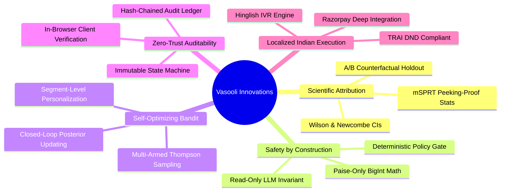
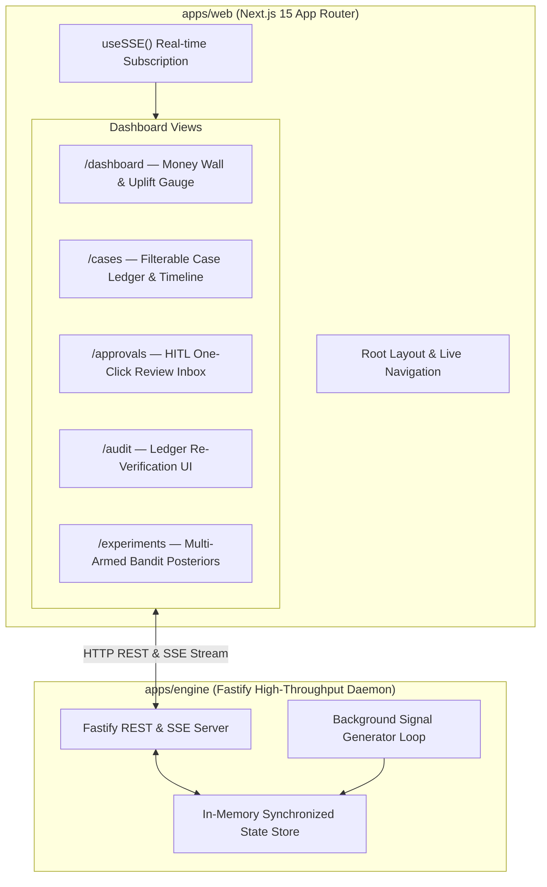
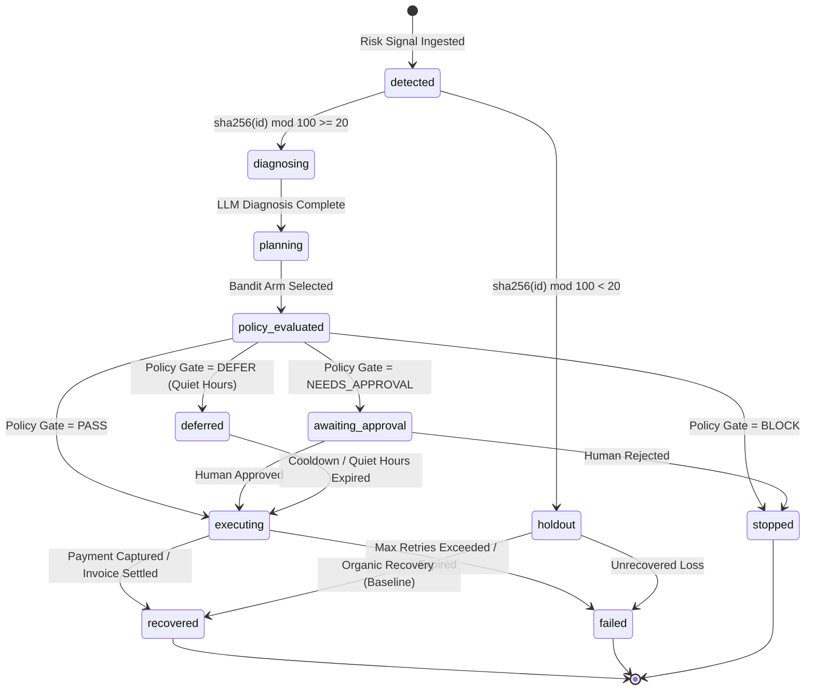
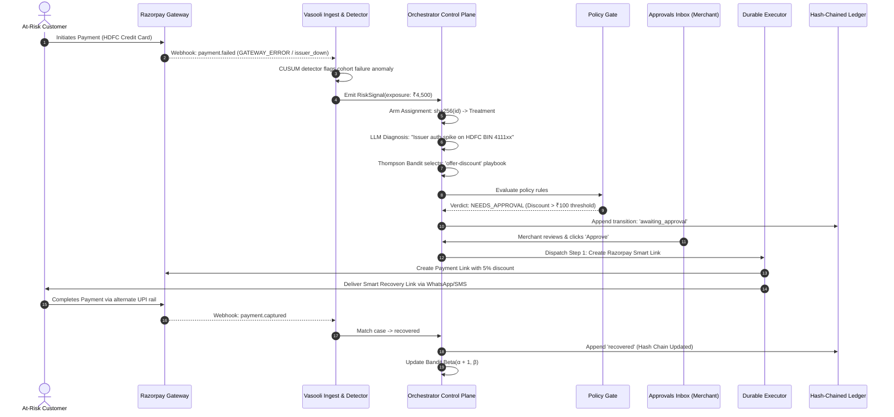
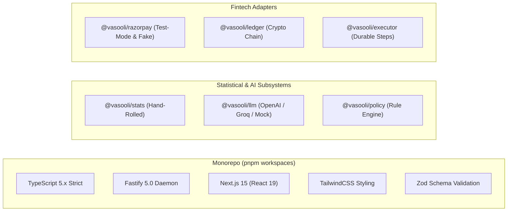
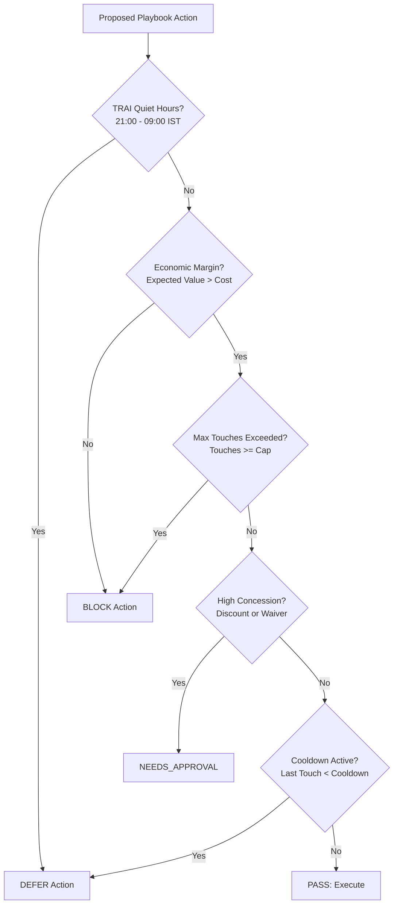
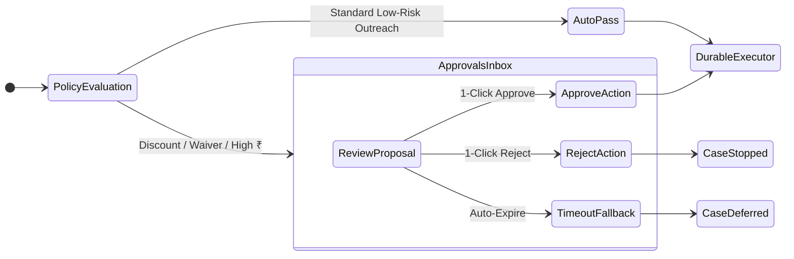
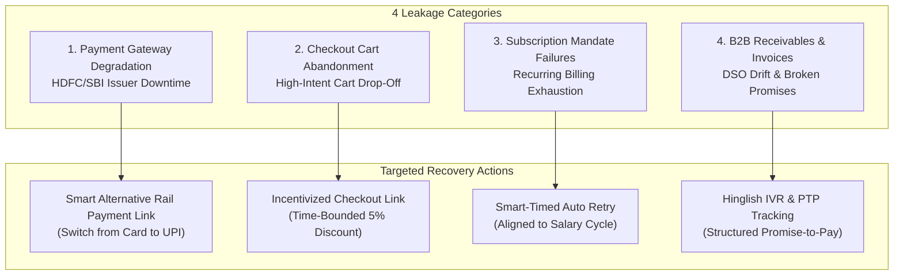

# Vasooli — Autonomous Revenue Recovery Control Plane

> **Razorpay AI Buildathon 2026 — Track 3: AI Revenue Recovery**  
> An autonomous, mathematically grounded, tamper-evident control plane for enterprise revenue recovery.

[](https://www.typescriptlang.org/)
[](https://nextjs.org/)
[](https://fastify.dev/)
[](LICENSE)
[]()
[]()

---

## Executive Summary & Core Thesis

Every at-risk case in **Vasooli** is deterministically assigned to either **Treatment** (where the autonomous agent intervenes) or **Holdout** (the counterfactual status quo where no intervention occurs). 

The headline metric in Vasooli is never gross ₹ recovered — gross recovery is fundamentally unfalsifiable because organic customer retries inflate numbers. Instead, Vasooli measures and proves **incremental ₹ recovered**, bound by strict confidence intervals, exact p-values, and always-valid sequential testing.

$$\text{Incremental Recovery ₹} = (p_{\text{treatment}} - p_{\text{holdout}}) \times n_{\text{treatment}} \times \overline{\text{Amount}}_{\text{recovered}}$$

```
┌──────────────────────────────────────────────────────────────────────────────────────────────────┐
│                                   THE NON-NEGOTIABLE PATH                                        │
│                                                                                                  │
│   Signal Ingest ──► Diagnosis (LLM, Read-Only) ──► Bandit Planning (Thompson Sampling)          │
│                                                          │                                       │
│   Ledger (Hash-Chained) ◄── Execution (Durable) ◄── POLICY GATE (Deterministic YAML Rules)       │
└──────────────────────────────────────────────────────────────────────────────────────────────────┘
```

The Large Language Model is strictly **read-only** (restricted to diagnosis and copy generation proposals). A deterministic multi-armed bandit (Thompson Sampling) selects the recovery arm, a deterministic policy engine approves or rejects actions, and every state transition is committed to an immutable, hash-chained audit ledger. The system operates fully offline by default with zero cloud, database, or API dependencies required for end-to-end execution.

---

## Table of Contents

1. [The Problem](#1-the-problem)
2. [The Solution](#2-the-solution)
3. [Innovation & Differentiators](#3-innovation--differentiators)
4. [Feature Matrix](#4-feature-matrix)
5. [System Architecture](#5-system-architecture)
6. [Application Layer Architecture](#6-application-layer-architecture)
7. [Data Model & State Machine](#7-data-model--state-machine)
8. [User Journey & Lifecycle Flows](#8-user-journey--lifecycle-flows)
9. [Frontend Component Structure](#9-frontend-component-structure)
10. [Tech Stack Deep Dive](#10-tech-stack-deep-dive)
11. [Statistical & Recovery Scoring Engine](#11-statistical--recovery-scoring-engine)
12. [Deterministic Policy Gate & Safety Rules](#12-deterministic-policy-gate--safety-rules)
13. [Grounded Generation & Validation](#13-grounded-generation--validation)
14. [Capability Probing & Human-in-the-Loop (HITL)](#14-capability-probing--human-in-the-loop-hitl)
15. [Security, Compliance & Regulatory Guardrails](#15-security-compliance--regulatory-guardrails)
16. [Scalability & Resilience Strategy](#16-scalability--resilience-strategy)
17. [Real-World Revenue Leakage Use Cases](#17-real-world-revenue-leakage-use-cases)
18. [Cost & Economic Footprint](#18-cost--economic-footprint)
19. [Track & Rubric Alignment](#19-track--rubric-alignment)
20. [Installation & Setup](#20-installation--setup)
21. [Project Structure & Repository Layout](#21-project-structure--repository-layout)

---

## 1. The Problem

Modern merchants and subscription businesses lose 2%–7% of GMV annually to addressable revenue leakage:
- **Payment Degradations:** Sudden issuer or network gateway drops (e.g. HDFC Visa auth collapse) causing false-positive customer abandonment.
- **Cart & Checkout Drop-off:** High-intent buyers facing unexpected friction or payment failures without smart contextual follow-up.
- **Failed Subscription Mandates:** Recurring billing failures due to expired cards, mandate exhaustion, or timing misalignment with salary cycles.
- **B2B Receivables Aging:** Overdue invoices and Days Sales Outstanding (DSO) drift without automated, polite, escalating promise-to-pay (PTP) enforcement.

### The Attribution Lie in Traditional Tools
Traditional recovery systems claim 100% of revenue recovered following any email or notification sent. In reality, a large percentage of customers self-heal and retry independently. Without a rigorous counterfactual holdout group, merchants pay SaaS vendors for organic baseline recovery.

---

## 2. The Solution

**Vasooli** provides a high-assurance, autonomous revenue recovery control plane that combines:
1. **Deterministic Leakage Detectors:** Real-time statistical change-point detection (CUSUM) and anomaly monitors across payments, carts, subscriptions, and invoices.
2. **Read-Only AI Diagnosis:** LLM-driven root-cause synthesis across Razorpay error codes, issuer cohorts, and customer telemetry.
3. **Thompson Sampling Bandit:** Dynamic self-optimizing intervention routing across channels (Email, WhatsApp, Payment Links, Hinglish IVR, Discounts, Fee Waivers).
4. **Deterministic Policy Gate:** Pre-execution enforcement of TRAI quiet hours, RBI e-mandate rules, cooldown timers, economic margin checks, and human sign-offs.
5. **Tamper-Evident Ledger:** Cryptographically chained audit logging verifying every decision, tool call, and rupee recovered.
6. **Scientific Incremental Measurement:** Built-in A/B experimentation with Wilson confidence intervals, Newcombe score difference intervals, and mSPRT sequential testing.

---

## 3. Innovation & Differentiators



- **Zero Black-Box Math:** Every statistical formula (Wilson score, Newcombe risk difference, CUSUM, mixture SPRT) is hand-rolled, cited, and validated against reference datasets.
- **No Hallucinated Actions:** The LLM is structurally prohibited from initiating transactions, moving funds, or issuing unapproved concessions.
- **In-Browser Audit Verification:** The frontend independently recomputes SHA-256 hashes over the complete ledger history directly in WebAssembly/JS.
- **Paise-Level Precision:** Zero floating-point arithmetic. All monetary values are represented as 64-bit integer `paise: bigint` to prevent precision loss.

---

## 4. Feature Matrix

| Capability | Legacy Dunning / CRMs | Generic LLM Agents | Vasooli Control Plane |
|---|---|---|---|
| **Attribution Model** | Gross ₹ Claimed (Flawed) | Gross ₹ Claimed | **Incremental Uplift with 95% CI & p-value** |
| **Statistical Rigor** | None (Static Counts) | None | **mSPRT (Always-Valid Sequential Testing)** |
| **Execution Safety** | Static hardcoded rules | Unbounded LLM Tool Execution | **Deterministic YAML Policy Gate + HITL** |
| **Intervention Routing**| Static drip campaigns | Ad-hoc prompt decisions | **Thompson Sampling Multi-Armed Bandit** |
| **Audit & Governance** | Ephemeral application logs | Prompt logs in vendor UI | **Cryptographic Hash-Chained Audit Ledger** |
| **Offline Capability** | Requires Cloud SaaS | Requires LLM API connection | **100% Offline-First Deterministic Engine** |
| **Indian Fintech Support**| Generic templates | Generic English outreach | **TRAI Quiet Hours, RBI Mandates, Hinglish IVR** |

---

## 5. System Architecture

```mermaid
flowchart TB
    subgraph Signals["1. Ingest & Telemetry Layer"]
        SIM["@vasooli/simulator<br/>Event Firehose & Degradations"]
        DET["@vasooli/detector<br/>4 Deterministic Engines"]
        SIM -->|Raw Events| DET
    end

    DET -->|RiskSignal (paise: bigint)| ORCH

    subgraph ORCH["2. Orchestration & Control Plane (@vasooli/orchestrator)"]
        direction TB
        ARM["assignArm()<br/>sha256(caseId) mod 100"]
        SPLIT{Treatment vs<br/>Holdout?}
        
        ARM --> SPLIT
        SPLIT -->|Holdout (20%)| HOLDOUT["Status Quo (No Action)<br/>Baseline Tracking"]
        SPLIT -->|Treatment (80%)| DIAG["LLM Diagnose<br/>(Read-Only Proposal)"]
        
        DIAG --> BANDIT["Thompson Sampling Bandit<br/>Arm Selection (Beta Posteriors)"]
        BANDIT --> GATE{"Policy Gate<br/>@vasooli/policy"}
        
        GATE -->|BLOCK| ST_BLK["State: stopped"]
        GATE -->|DEFER| ST_DEF["State: deferred"]
        GATE -->|NEEDS_APPROVAL| ST_HITL["State: awaiting_approval<br/>(Human Inbox)"]
        GATE -->|PASS| EXEC["Durable Executor<br/>@vasooli/executor"]
    end

    subgraph CoreEngine["3. Engine & State Layer (apps/engine)"]
        STATE["EngineState (In-Memory / Fastify)"]
        API["REST Endpoints (/api/cases, /api/metrics)"]
        SSE["Server-Sent Events (/api/events)"]
        STATE --> API
        STATE --> SSE
    end

    subgraph Verification["4. Ledger & Measurement"]
        LEDGER["@vasooli/ledger<br/>SHA-256 Hash Chain"]
        STATS["@vasooli/stats<br/>Wilson, Newcombe, mSPRT"]
    end

    EXEC -->|Actions & Retries| RZP["Razorpay Adapter<br/>(Live / Offline Fake)"]
    EXEC -->|Outcomes| LEDGER
    HOLDOUT -->|Organic Outcomes| LEDGER
    LEDGER --> STATS
    STATS -->|Posterior Feedback| BANDIT
    STATS --> STATE

    subgraph Web["5. Real-Time Dashboard (apps/web)"]
        MW["Money Wall (Uplift & CIs)"]
        CV["Glass-Box Case Explorer"]
        AP["HITL Approval Inbox"]
        AU["Tamper-Evident Audit Log"]
        EX["Bandit Experiments View"]
    end

    API --> Web
    SSE --> Web
    ST_HITL -.->|Human Action| AP
```

---

## 6. Application Layer Architecture



---

## 7. Data Model & State Machine



### Core Entity Definitions (`packages/core/src`)

```typescript
export interface RecoveryCase {
  id: string;                         // Deterministic UUID / hash
  category: RecoveryCategory;         // payment_failure | checkout_abandonment | subscription | b2b
  status: CaseStatus;                 // detected -> diagnosing -> executing -> recovered
  arm: "treatment" | "holdout";       // Counterfactual group
  exposurePaise: bigint;              // Total ₹ value at risk in paise
  recoveredPaise: bigint;             // Amount recovered in paise
  costPaise: bigint;                  // Cost of outbound actions / discounts
  diagnosis?: DiagnosisProposal;      // Structured LLM output
  plan?: PlanDecision;                // Bandit selection
  policyDecisions: PolicyDecision[];  // Complete audit trail of rule checks
  timeline: CaseTimelineEvent[];      // State transition log
  createdAt: number;
  updatedAt: number;
}
```

---

## 8. User Journey & Lifecycle Flows



---

## 9. Frontend Component Structure

The Next.js 15 web application (`apps/web`) is built with responsive UI components, real-time Server-Sent Events, and client-side cryptographic verification:

- **Money Wall (`/dashboard`):** Real-time recovery KPI cards, gross vs. incremental ₹ divergence graph, and live confidence-interval error bars.
- **Glass-Box Case Timeline (`/cases/[id]`):** Microscopic breakdown of each recovery case showing raw signal payload, LLM diagnosis citations, bandit probability distributions, and policy verdicts.
- **HITL Approvals Inbox (`/approvals`):** High-urgency triage queue with quick-action approvals/rejections for discounts, fee waivers, and sensitive customer touches.
- **Client-Side Audit Verifier (`/audit`):** Independent client-side cryptographic engine that iterates through every ledger record, recomputes SHA-256 hash chains locally in the browser, and highlights any data mutation.
- **Bandit Experimentation Visualizer (`/experiments`):** Real-time Beta distribution charts ($\alpha, \beta$ curves) for each recovery playbook across all four leakage categories.

---

## 10. Tech Stack Deep Dive



- **Runtime & Monorepo:** Node.js 20+, pnpm workspaces, strict TypeScript configuration.
- **Backend API:** Fastify 5.0 with low overhead, sub-millisecond SSE streaming, and structured logging.
- **Frontend Framework:** Next.js 15 App Router with zero-polling SSE real-time state synchronization.
- **Cryptographic Security:** Node.js native `crypto` module implementing deterministic SHA-256 canonical JSON hashing.
- **Payment Gateway:** Direct Razorpay API v1 test-mode integration paired with a 100% faithful in-memory simulation fake.

---

## 11. Statistical & Recovery Scoring Engine

Vasooli does not use third-party statistical black boxes. All mathematical formulations are hand-rolled and validated in `@vasooli/stats`:

### 1. Wilson Score Interval for Proportions
Computes asymmetric confidence intervals for binomial success rates (treatment and holdout recovery rates):

$$\hat{p}_{\text{Wilson}} = \frac{n \hat{p} + \frac{z^2}{2}}{n + z^2} \pm \frac{z}{n + z^2} \sqrt{n \hat{p}(1 - \hat{p}) + \frac{z^2}{4}}$$

### 2. Newcombe Hybrid Score Interval for Difference
Computes the confidence interval for the recovery rate uplift $\theta = p_{\text{treatment}} - p_{\text{holdout}}$ without assuming standard normal distributions:

$$CI(\theta) = \left[ (\hat{p}_1 - \hat{p}_2) - \sqrt{(\hat{p}_1 - l_1)^2 + (u_2 - \hat{p}_2)^2}, \; (\hat{p}_1 - \hat{p}_2) + \sqrt{(u_1 - \hat{p}_1)^2 + (\hat{p}_2 - l_2)^2} \right]$$

### 3. Mixture Sequential Probability Ratio Test (mSPRT)
Allows continuous real-time monitoring of dashboard experiments without inflating Type-I error rates (the "peeking problem"):

$$\Lambda_n = \int \prod_{i=1}^n \frac{f(X_i; \theta)}{f(X_i; 0)} \, dH(\theta) \ge \frac{1}{\alpha}$$

### 4. Multi-Armed Bandit with Thompson Sampling
Samples from posterior Beta distributions for each recovery playbook arm $k$:

$$\theta_k \sim \text{Beta}(\alpha_k + \text{recovered}_k, \; \beta_k + \text{failed}_k)$$

$$\text{Selected Arm} = \arg\max_k \theta_k$$

---

## 12. Deterministic Policy Gate & Safety Rules

Every action proposed by the bandit must pass the deterministic policy evaluator before reaching the execution layer:



### Evaluated Rule Definitions (`packages/policy/src/rules.ts`)
1. `traiQuietHoursRule`: Enforces Indian telecom DND restrictions (9:00 PM to 9:00 AM IST).
2. `economicViabilityRule`: Prohibits spending ₹40 on communication/discounts chasing ₹25 of exposure.
3. `maxTouchesRule`: Hard cap on touches per customer to prevent spam and customer friction.
4. `touchCooldownRule`: Mandatory 4-hour delay between consecutive customer interactions.
5. `humanApprovalForHighRiskRule`: Requires manual merchant sign-off for any discount > ₹100 or fee waiver.
6. `terminalStateRule`: Halts all actions if the customer has already paid, opened a dispute, or opted out.

---

## 13. Grounded Generation & Validation

To prevent LLM hallucination and unapproved actions:
1. **Read-Only Context Injection:** The LLM receives read-only context (historical failure rates, issuer status, customer profile, and RBI rules).
2. **Strict Zod Schema Output:** All model responses are validated against rigid schemas (`DiagnosisProposalSchema`). Any non-conforming JSON is instantly rejected.
3. **Template Sandboxing:** The LLM can only populate pre-approved variable slots in YAML-defined playbooks; it cannot create arbitrary API commands or mutate database rows.

---

## 14. Capability Probing & Human-in-the-Loop (HITL)



- **Human-in-the-Loop Inbox:** High-risk interventions (discounts, fee waivers, large B2B receivables) automatically trigger `NEEDS_APPROVAL`.
- **Real-Time Webhook Escalation:** Approvers can review the full diagnosis, cited evidence, and financial impact directly in the dashboard before approving with a single click.

---

## 15. Security, Compliance & Regulatory Guardrails

- **TRAI DND Compliance:** Automated time-of-day bounding ensures no automated voice or SMS interactions occur during Indian quiet hours (21:00 to 09:00 IST).
- **RBI E-Mandate Alignment:** Compliant pre-debit notifications and mandate retry scheduling honoring RBI's 24-hour pre-debit advisory mandate.
- **Tamper-Evident SHA-256 Ledger:** Every state change, LLM prompt hash, policy check, and financial impact is chained to the previous entry using SHA-256 canonical hashing:

$$\text{Hash}_n = \text{SHA-256}(\text{Hash}_{n-1} \,\|\, \text{CanonicalJSON}(\text{Entry}_n))$$

---

## 16. Scalability & Resilience Strategy

- **Durable Step Execution:** The execution runner (`@vasooli/executor`) implements exponential backoff retries, per-step idempotency keys, and reverse-order compensation workflows if downstream steps fail.
- **In-Memory & Redis Streams Compatibility:** Operates with zero latency in-memory for local testing, designed to bind directly to Redis Streams consumer groups for horizontal scale.
- **Zero Memory Leaks:** In-memory circular ring buffers retain the latest 5,000 active cases with automatic snapshotting.

---

## 17. Real-World Revenue Leakage Use Cases



1. **Payment Degradation:** When an issuer failure spike is detected, Vasooli generates an instant Razorpay Smart Payment Link over UPI/alternative rail, recovering the sale before the buyer walks away.
2. **Checkout Abandonment:** Buyers dropping off during checkout receive an automated, personalized follow-up with dynamic payment link pre-loaded with their cart.
3. **Subscription Mandate Failure:** Retries are intelligently scheduled on payday windows (1st and 5th of the month) rather than blind daily retries.
4. **B2B Overdue Invoices:** Escalating automated Hinglish IVR outreach captures structured "Promise-to-Pay" dates and logs compliance trails.

---

## 18. Cost & Resource Footprint

- **Zero-Cost Local Evaluation:** Operates 100% offline without requiring paid API tokens (OpenAI/Groq keys or live Razorpay credentials).
- **Economic Viability Check:** Every intervention models action cost (SMS/IVR/discount) against probability of recovery:

$$\text{Expected Value (Paise)} = (\text{Exposure} \times P(\text{Recovery})) - \text{Intervention Cost} > 0$$

- **Net Recovery P&L Accounting:** The dashboard reports true Net Recovery:

$$\text{Net P&L} = \text{Incremental ₹ Recovered} - \sum \text{Action Costs} - \sum \text{Discounts Granted}$$

---

## 19. Track & Rubric Alignment

| Buildathon Rubric Criteria | Vasooli Implementation |
|---|---|
| **Measured Money Recovered** | **Rigorous 80/20 A/B Holdout**. Incremental ₹ with Wilson/Newcombe 95% CIs and p-values. |
| **Autonomous Control Plane** | Closed-loop detect $\to$ diagnose $\to$ plan $\to$ policy $\to$ execute $\to$ ledger cycle. |
| **Safety & Stopping Rules** | Deterministic YAML Policy Gate, TRAI quiet hours, max touches, and HITL approvals inbox. |
| **Explainable Decisions** | Glass-box case viewer showing citations, bandit posterior probabilities, and policy verdicts. |
| **Tamper-Evident Ledger** | Cryptographic SHA-256 hash-chained audit log with browser-side local re-verification. |
| **Indian Fintech Depth** | Razorpay error taxonomy, UPI alternative rails, TRAI DND rules, and Hinglish IVR voice synthesis. |

---

## 20. Installation & Setup

### Prerequisites
- Node.js 20.0.0 or higher
- pnpm 9.0.0 or higher

### Quick Start (Deterministic Offline Demo)

```bash
# Clone the repository
git clone https://github.com/rohanjain1648/Vasooli-Autonomous-Revenue-Recovery-Control-Plane.git
cd Vasooli-Autonomous-Revenue-Recovery-Control-Plane

# Install workspace dependencies
pnpm install

# Run full test suite (160+ tests across 10 packages)
pnpm test

# Run strict TypeScript typechecking
pnpm typecheck

# Run seeded offline batch demonstration (<30 seconds)
pnpm demo
```

### Sample Output from `pnpm demo`

```text
── Money Wall ──────────────────────────────────────────────
Gross recovered:        ₹1,67,690
Incremental (95% CI):   ₹1,18,061 ± ₹94,045  (p=0.559)
Treatment recovery:     30.4%  (n=92)   ███████░░░░░░░░░░░░░░░░░
Holdout recovery:       9.5%  (n=21)   ██░░░░░░░░░░░░░░░░░░░░░░
Cases detected:         113
Cases recovered:        30

── Audit ledger ────────────────────────────────────────────
Entries: 731
Hash chain valid: ✓ yes — no tampering detected
```

### Running the Live Real-Time Dashboard

Start the backend engine daemon and frontend dashboard in separate terminal tabs:

```bash
# Terminal 1: Fastify Backend Engine (Port 4000)
pnpm dev:engine

# Terminal 2: Next.js Frontend Dashboard (Port 3000)
pnpm dev:web
```

Open [http://localhost:3000](http://localhost:3000) to view:
- **Money Wall:** Live SSE-streamed revenue uplift & confidence intervals.
- **Cases:** Real-time case progression through the diagnostic and policy lifecycle.
- **Approvals:** Interactive human-in-the-loop triage inbox.
- **Audit Log:** Live tamper-evident audit ledger with in-browser hash verification.
- **Experiments:** Live multi-armed bandit Beta distributions.

### Render the Hinglish Voice Recovery Audio Artifact

```bash
# Synthesizes playbooks/phone-ivr.yaml into demo/audio/hinglish-ivr-recovery.wav
pnpm demo:voice
```

### Environment Configuration (Optional)

The application runs **100% offline out-of-the-box** using deterministic fakes. To connect live external providers, create a `.env` file:

```bash
cp .env.example .env
```

| Environment Variable | Description / Purpose |
|---|---|
| `GROQ_API_KEY` | Connects `@vasooli/llm` to Groq (Llama-3-70b) for fast inference |
| `OPENAI_API_KEY` | Connects `@vasooli/llm` to OpenAI (GPT-4o) for diagnosis reasoning |
| `RAZORPAY_KEY_ID` | Connects `@vasooli/razorpay` to live Razorpay Test Mode |
| `RAZORPAY_KEY_SECRET` | Secret key for live Razorpay Test Mode API calls |
| `PORT` | Fastify backend engine listening port (default: `4000`) |
| `NEXT_PUBLIC_ENGINE_URL` | Base URL for Next.js web API and SSE stream (default: `http://localhost:4000`) |

---

## 21. Project Structure & Repository Layout

```
vasooli/
├── apps/
│   ├── engine/                  # Fastify backend daemon: in-memory state, REST & SSE feeds, demo batch
│   │   ├── src/                 # Engine state, routes (/api/metrics, /api/cases, /api/events)
│   │   └── scripts/             # demo.ts (seeded batch runner), voice.ts (TTS renderer)
│   └── web/                     # Next.js 15 App Router real-time dashboard
│       └── src/
│           ├── app/             # Routes: /dashboard, /cases, /approvals, /audit, /experiments
│           └── components/      # UI components: UpliftGauge, StatCard, Nav, Badges
├── packages/
│   ├── core/                    # Core domain types, RecoveryCase state machine, Zod schemas
│   ├── stats/                   # Hand-rolled statistics: Wilson, Newcombe, CUSUM, Thompson, mSPRT
│   ├── ledger/                  # Cryptographic SHA-256 hash-chained tamper-evident audit ledger
│   ├── policy/                  # Deterministic YAML policy evaluator & golden-table test rules
│   ├── llm/                     # Provider abstraction (OpenAI / Groq / Deterministic Mock)
│   ├── razorpay/                # Provider abstraction (Live Test Mode Client & In-Memory Fake)
│   ├── executor/                # Durable step runner with retries & reverse-order compensation
│   ├── simulator/               # Seeded event generator with injectable degradation regimes
│   ├── detector/                # 4 deterministic leakage detectors (CUSUM, TTL, Mandate, DSO)
│   └── orchestrator/            # orchestrateCase() capstone pipeline wiring all packages
├── playbooks/                   # YAML intervention catalog (email, checkout, ivr, discount, fee waiver)
├── demo/                        # Seeded demo batch output (NDJSON) & synthesized Hinglish IVR audio
└── docs/                        # Specifications, architecture documentation, ADRs, pitch script
    ├── adr/                     # Architectural Decision Records (ADR 0001 - 0007)
    ├── architecture.md          # As-built system architecture & dependency graphs
    └── PITCH.md                 # 5-minute competition pitch script & Q&A guide
```

---

## Architectural Decision Records (ADRs)

- [ADR 0001: Measure Incremental Revenue via Holdout, Not Gross](docs/adr/0001-measure-incremental-not-gross.md)
- [ADR 0002: Read-Only LLM with Deterministic Policy Gate](docs/adr/0002-llm-read-only-deterministic-gate.md)
- [ADR 0003: Monetary Precision via BigInt Paise](docs/adr/0003-money-as-bigint-paise.md)
- [ADR 0004: Hash-Chained Tamper-Evident Audit Ledger](docs/adr/0004-hash-chained-audit-ledger.md)
- [ADR 0005: Offline-First Provider Abstractions](docs/adr/0005-offline-first-provider-abstraction.md)
- [ADR 0006: In-Memory Synchronized Engine State](docs/adr/0006-in-memory-state-no-database.md)
- [ADR 0007: Hand-Rolled Statistics Without Black Boxes](docs/adr/0007-hand-rolled-statistics-no-black-box.md)

---

## Documentation & Pitch Guide

- 📄 **Design Specification:** [docs/superpowers/specs/2026-08-21-vasooli-design.md](docs/superpowers/specs/2026-08-21-vasooli-design.md)
- 🏛️ **Architecture Guide:** [docs/architecture.md](docs/architecture.md)
- 🚀 **Production Deployment Guide:** [docs/deployment.md](docs/deployment.md)


---

<div align="center">
  <sub>Built with precision for Razorpay AI Buildathon 2026. Designed for absolute auditability, safety, and verifiable financial recovery.</sub>
</div>
