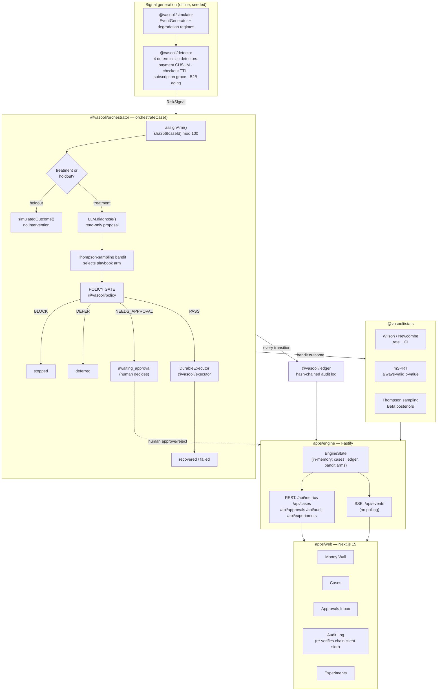

# Architecture

This describes the system as built, not the original scaffold plan — see
[ADR 0006](adr/0006-in-memory-state-no-database.md) for what changed and why.

## System overview



## The non-negotiable path

Every case, regardless of category or arm, goes through this exact
sequence — nothing skips the policy gate, and the LLM's output never
reaches the executor directly:

```
signal → diagnose (LLM, read-only) → plan (bandit, never the LLM)
       → POLICY GATE (deterministic) → execute → ledger
```

See [ADR 0002](adr/0002-llm-read-only-deterministic-gate.md).

## Repo layout (as built)

```
vasooli/
├── apps/
│   ├── engine/          Fastify: EngineState, REST + SSE, signal feed, demo scripts
│   └── web/              Next.js 15 dashboard (6 pages, all SSE-live)
├── packages/
│   ├── core/              Domain types, RecoveryCase state machine, Zod schemas
│   ├── stats/             wilson, newcombe, cusum, thompson, mSPRT — hand-rolled
│   ├── ledger/            Hash-chained tamper-evident audit log
│   ├── policy/            Deterministic rule engine + golden-table tests
│   ├── llm/               Provider abstraction (openai/groq | mock)
│   ├── razorpay/          Provider abstraction (live | fake)
│   ├── executor/          Durable step runner: retries + reverse-order compensation
│   ├── simulator/         Seeded event generator + degradation regimes
│   ├── detector/          4 deterministic leakage detectors
│   └── orchestrator/      orchestrateCase() — wires every package above together
├── playbooks/            YAML intervention catalog (arms, templates, approval flags)
├── demo/                 Seeded batch output + rendered Hinglish IVR audio
└── docs/                 design doc, this file, ADRs, PITCH.md
```

## Why the dependency graph points one way

`orchestrator` depends on `core`, `stats`, `policy`, `llm`, `razorpay`,
`executor`, and `ledger` — never the reverse. Each of those packages is
independently testable and has zero knowledge that an orchestrator exists,
which is what let every package in Plans 2–4 be built and fully tested in
isolation before `orchestrator` wired them together as the capstone
integration. `apps/engine` depends on all of the above plus `simulator`
and `detector` (for the live signal feed); `apps/web` depends on nothing
in the monorepo except talking to `apps/engine` over HTTP/SSE — it could
be swapped for a different frontend with no package changes.
